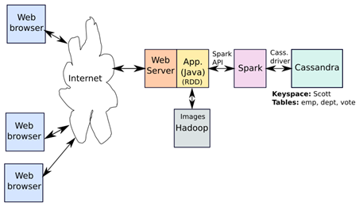
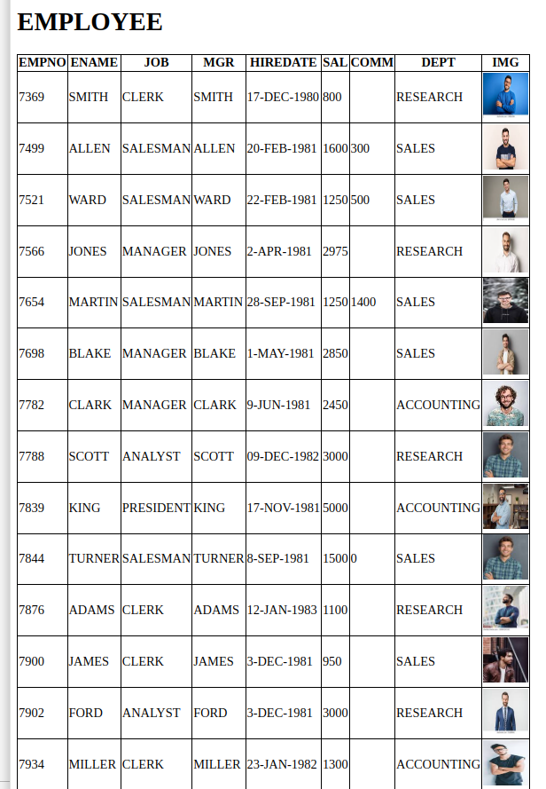

# SWE307-2023 PROJECT 2
## Due date: 4.1.2023 Thursday, in class.

SELECT THE PROBLEM A OR B : I will register group project selections in the class of 7 December 2023.

## DESCRIPTION OF PROBLEM A:

In this project study, you are asked to create the big data-based web information system shown in Figure 1. In the project work, the data is given in the "emp.csv", and “dept.csv” files on GitHub. You can use the same data/files from the previous project. “vote” table data must be generated.  

**What is required from you is as follows:**

A Java web application will perform the following tasks:

**1)** Employee and department data will be read from Cassandra. Initial data to these tables can be loaded from csv files. “vote” table has 3 three columns, empno, like and dislike: empno has the same type of “emp” table column due to 1-1 relation, like and dislike columns will be counter type.  
**2)** The images will be fetched from HDFS as done in Project 1. You don’t need to do anything on this. 
**3)** There will be two views “index.html” and “add.html”: on index page the information about employee must be displayed full including the joins done in Spark module. Both manager names and department names must be shown as in Project 1. Add page is just to add a new employee to the “emp” table.  
**4)** In the index view there will be counter columns for “Like” and “Dislike”, as well as button columns for “Like” and “Dislike”. 
**5)** If “Like” (or “Dislike”) button pressed, the counter must be increased in the Cassandra DB and the view must be refreshed to reflect this change.  
**6)** Add button must be somewhere on top of index view. Once pressed, required data must be collected properly and changes shown after “SAVE” button pressed. 

 

 
**Figure 1.** Big data based web information system.
 
**PS:** Example image files and csv files will be provided on Github repository, you can clone/download everything provided. 
 
 
**Working example output is shown below:**
 

