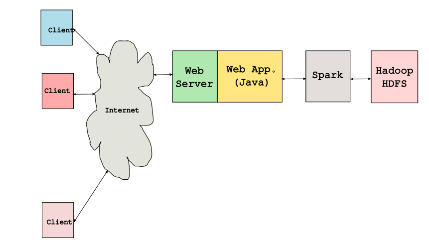

# SWE307-2023
## Due date: 9.11.2023 Thursday, in class.

In this project study, you are asked to create the big data-based information system shown in Figure 1. In the project work, the employee information of the company named "Magic" is stored in the "emp.csv" file on Hadoop-HDFS. The company's department information is stored in the "dept.csv" file. These two files are under the path "/user/hadoop/magic/data". Employee images are under the "/user/hadoop/magic/image" directory. 

**What is required from you is as follows:**

**1)** Hadoop-HDFS will be installed to create a HDFS - Spark pipeline.
 
**2)** A simple Java Web application will be developed to perform the following tasks: 
*	**a)** Personnel and department data will be read from CVS files as if reading data 	from the database (writing operation is not required) 
	**b)** Personnel images will be taken via HDFS (may be with or without using Spark). 
	**c)** There will be a single web page, on this page the information will be displayed in a table using the JOIN operation on Spark DF. Information to display: employee 	name, manager name, salary, commission, department. 
	**d)** You are free to use Scala or Python to read and JOIN CSV data on DF with RDD. 	For this you will need to write a small program in Scala (or Python). 
 

 
**Figure 1.** Big data based web information system.
 
**PS:** Example image files and csv files will be provided on Github repository, you can clone/download everything provided. 
