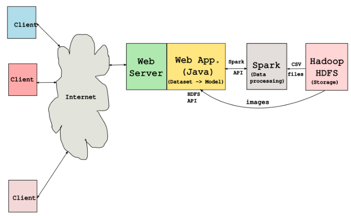
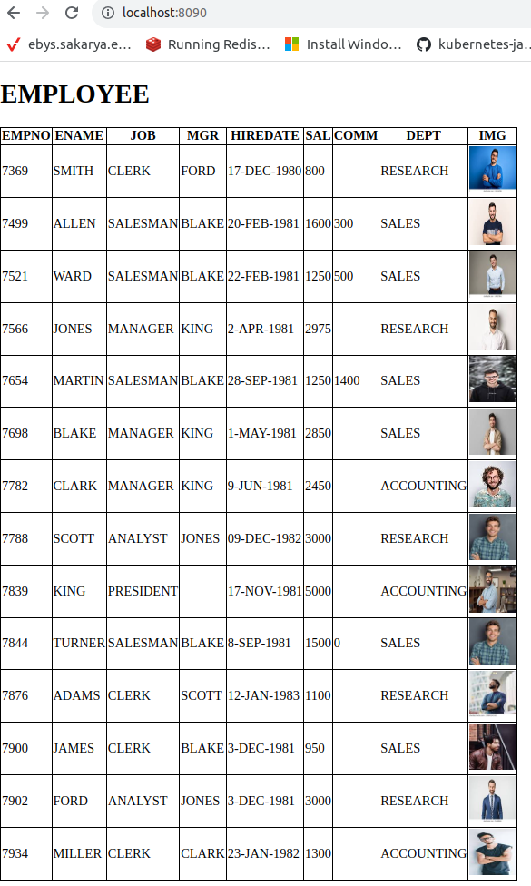

# SWE307-2023 PROJECT 2
## Due date: 4.1.2023 Thursday, in class.

## SELECT THE PROBLEM A OR B : 
I will register group project selections in the class of 7 December 2023.

## DESCRIPTION OF PROBLEM A:

In this project study, you are asked to create the big data-based web information system shown in Figure 1. In the project work, the data is given in the "emp.csv", and “dept.csv” files on GitHub. You can use the same data/files from the previous project. “vote” table data must be generated.  

**What is required from you is as follows:**

**1)** Hadoop-HDFS will be installed to create a HDFS - Spark pipeline.
 
**2)** A simple Java Web application will be developed to perform the following tasks: 
	&nbsp;&nbsp;&nbsp;**a)** Employee and department data will be read from CVS files as if reading data from the database (writing operation is not required) 
	&nbsp;&nbsp;&nbsp;**b)** Employee images will be taken directly from HDFS. 
	&nbsp;&nbsp;&nbsp;**c)** There will be a single web page, on this page the information will be displayed in a table using the JOIN operation on Spark dataset. Information to display: employee name, manager name, salary, commission, department. 
	&nbsp;&nbsp;&nbsp;**d)** You implement read and JOIN operations on CSV files provided using Java and Spring-Boot framework. You can develop your data processing part using spark-shell and scripts with Scala (or Python), and copy them to Java program as we did in the class. 
 

 
**Figure 1.** Big data based web information system.
 
**PS:** Example image files and csv files will be provided on Github repository, you can clone/download everything provided. 
 
 
**Working example output is shown below:**
 

